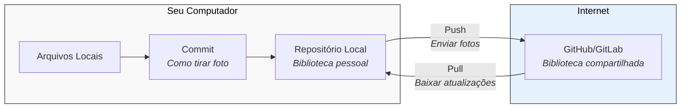

<!-- Título -->
# Criando Repositórios

***Conteúdo da Aula:***

Aula teórica.

## :memo: Explicação do Processo

Um repositório é como uma biblioteca digital onde guardamos nossos arquivos de código de forma organizada. Assim como uma biblioteca tem livros catalogados e prateleiras bem organizadas, um repositório mantém todos os seus arquivos de programa em ordem e seguros.

### Vocabulário Básico:

- `Repositório` &#8594; Uma pasta especial que guarda seu código de forma organizada.
- `Commit` &#8594; Como tirar uma foto do estado atual dos seus arquivos.
- `Push` &#8594; Enviar suas mudanças para o repositório online.
- `Pull` &#8594; Baixar mudanças do repositório online para seu computador.

### Entendendo o Diagrama

Imagine que você está organizando suas fotos em álbuns:

- Seus arquivos locais são como as fotos que você tirou recentemente.
- Um commit é como criar um novo álbum e escolher quais fotos colocar nele.
- Seu repositório local é como uma estante onde você guarda todos os seus álbuns.
- O GitHub/GitLab é como uma galeria de arte online onde você pode compartilhar seus álbuns com outras pessoas.

### Cuidado!

- Sempre faça commits antes de enviar mudanças para o repositório remoto.
- Verifique se você está na pasta correta antes de criar um novo repositório.
- Use nomes descritivos para seus commits, assim como você daria nomes significativos para seus álbuns.

> [!IMPORTANT]\
> **Boas práticas**:
>
> - Uso de analogias para explicar conceitos técnicos.
> - Estruturação progressiva do conhecimento.
> - Apresentação visual com diagrama.
> - Divisão em seções compreensíveis.

---

> [!WARNING]\
> **Recomendações**:
>
> - Adicionar exemplos de comandos Git.
> - Mencionar tipos de repositórios (público/privado).

---

<!-- > [!NOTE]\
> **Observações**:
>

--- -->

### :clipboard: Próximos Passos

- Aprender comandos básicos do Git.
- Praticar fluxo de trabalho em repositórios.
- Estudar colaboração em projetos.
- Como criar um repositório novo.
- Como fazer commits regulares.
- Como trabalhar em equipe usando repositórios.
- Como resolver conflitos quando várias pessoas modificam os mesmos arquivos.

### :bulb: Dicas do Especialista

- Repositórios são como diários de desenvolvimento.
- Cada commit conta uma história do seu código!

### :bookmark: Tags

`#Repositorios` `#DesenvolvimentoDeSoftware` `#Git` `#Iniciantes`

<!-- Informações -->
### &#8505; Informações

&nbsp;

&nbsp;

&nbsp;

&nbsp;

&nbsp;

&nbsp;

